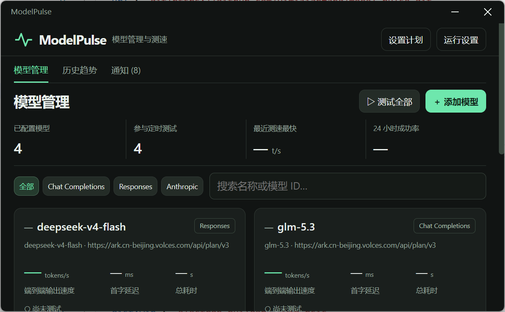
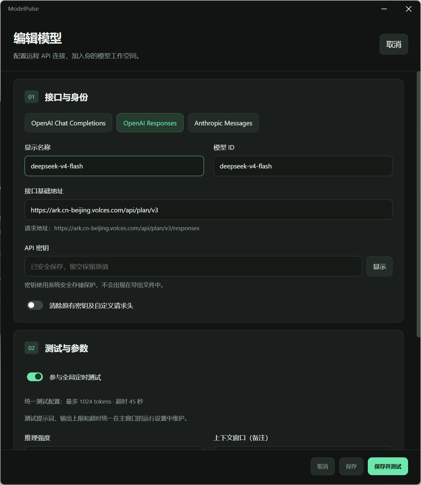

# ModelPulse

<p align="center">
  
</p>

<p align="center">
  一个面向多模型 API 的本地桌面管理与定时性能监测工具。
</p>

<p align="center">
  <strong>Windows · macOS · Linux</strong> · Electron · Node.js · SQLite · ECharts
</p>

ModelPulse 将模型连接配置、流式测速、定时任务、历史趋势和排名变化通知集中在一个本地应用中。它适合比较兼容 OpenAI 或 Anthropic 协议的多个服务端点，并长期观察速度、首字延迟和稳定性变化。

## 界面预览

### 模型管理



集中查看模型协议、端点、定时参与状态以及最近一次测速结果。支持按协议筛选、搜索、单模型测试和批量测试。

### 独立模型编辑器



添加和编辑操作在独立窗口完成，可配置模型 ID、基础地址、API 密钥、额外参数、自定义请求头、推理强度和备注。

### 系统通知


模型排名在满足阈值和连续确认规则后，可发送系统通知并写入应用内通知记录。

> `assets/archive/` 保存旧版界面截图，仅用于历史留档，不代表当前 UI。

## 主要功能

### 多协议模型管理

- 支持 OpenAI Chat Completions、OpenAI Responses 和 Anthropic Messages。
- 每个模型可独立设置显示名称、模型 ID、基础地址和是否参与定时测试。
- 支持额外请求参数与自定义请求头；禁止覆盖流式开关、模型、测试输入和输出上限等关键字段。
- 配置可导入和导出，导出文件不包含 API 密钥或自定义请求头。
- “添加模型”“设置计划”“运行设置”均使用独立子窗口；重复打开同类设置时聚焦已有窗口。
- 设置窗口存在未保存修改时，关闭前会要求确认。

### 流式性能测试

- 支持单模型测试和全部模型串行测试。
- 展示端到端输出速度、首字延迟、总耗时、输出 token 数和测试状态。
- 汇总最近 24 小时成功率，并标识取消、失败、配置已变化和估算用量。
- 测试可随时停止；失败请求不会自动重试，避免重复计费。
- 所有模型共用测试提示词、输出上限和超时设置，确保对比口径一致。

### 定时计划与排名通知

- 使用本机时区运行五段 Cron 计划。
- 提供每小时、间隔分钟、每天、每周和自定义 Cron，并预览未来五次执行时间。
- 默认计划为每小时执行一次，但首次启动时不会自动开启。
- 排名变化默认要求领先至少 5%，并连续确认 2 轮。
- 首次测试只建立排名基准；失败、取消、估算用量和手动测试不会触发排名变化通知。
- 支持系统通知和应用内通知记录；通知记录可以二次确认后全部清空。

### 历史趋势

- 通过 ECharts 展示输出速度、首字延迟和总耗时趋势。
- 可按模型、时间范围和指标筛选，单次最多加载最近 3,000 条记录。
- 底部时间轴支持拖拽缩放；切换指标时保留缩放范围。
- 点击模型图例会同步控制曲线和下方历史明细的显隐。
- 参数指纹变化、失败或取消会使曲线断开，避免产生误导性连线。
- 历史明细默认收起并展示最新 50 条；可二次确认后清空全部历史。
- 清空历史不会删除模型或凭据，但会重置排名基准。

### 桌面体验

- 主标题区、操作区和页面导航会在滚动时吸附在窗口顶部。
- 首页右下角显示当前安装包版本。
- 关闭主窗口后可继续驻留系统托盘。
- 安装版支持开机启动；系统休眠时取消当前请求，恢复后不补跑错过的计划。

## 安装

### Windows

从 GitHub Releases 下载 `ModelPulse Setup <版本号>.exe`，运行安装程序并选择安装目录。

如需免安装运行，也可以使用构建产物中的 `win-unpacked/ModelPulse.exe`。

> 当前发行包未配置商业代码签名。Windows 可能显示未知发布者提示，请仅从本项目的 GitHub Releases 下载，并按 Release 页面提供的 SHA-256 校验文件。

### macOS 与 Linux

GitHub Actions 会在版本标签发布时构建：

- macOS：DMG、ZIP
- Linux：AppImage、DEB

跨平台安装包应在对应操作系统上进行最终验证。

## 数据、凭据与隐私

应用数据默认保存在：

```text
~/.model-pulse/model-pulse.sqlite
```

测试或多实例环境可通过 `MODELPULSE_DATA_DIR` 指定独立目录。

API 密钥和自定义请求头由 Electron `safeStorage` 调用操作系统能力加密后写入本地数据库：

- Windows：DPAPI
- macOS：Keychain
- Linux：系统密钥环

Linux 检测到仅有 `basic_text` 后端时会拒绝保存凭据。该机制不提供跨设备同步；同一 Windows 登录用户下运行的其他程序仍可能使用 DPAPI 解密数据。

所有模型请求和凭据操作都在 Electron 主进程完成。渲染层禁用 Node.js，启用 context isolation 与 sandbox，并拒绝远程导航、任意弹窗和外部脚本。

## 测试口径

默认测试提示词：

> Output the numbers 1 through 120 separated by a single space. No commas, no newlines, no explanation.

默认最多输出 1,024 tokens，单次请求超时 45 秒，历史保留 90 天。

端到端输出速度计算方式：

```text
tokens/s = 服务商返回的输出 token 数 ÷ 请求总耗时
```

总耗时包含首字等待。若服务商未返回输出用量，ModelPulse 会用 Unicode 字符数除以 4 后向上取整进行粗略估算，并明确标记；估算结果不会参与排名通知。不同模型的 tokenizer、推理 token 和计费口径可能不同，因此结果适合作为持续观察指标，而不是绝对能力排名。

兼容性说明：

- Chat Completions 端点需支持流式 SSE、`max_completion_tokens` 和 `stream_options.include_usage`。
- Anthropic thinking 等扩展参数可通过额外参数 JSON 配置。
- 基础地址通常填写到 `/v1`，也接受已经包含完整协议端点的地址。

## 本地开发

需要 Node.js 22.14.0 或更高版本。

```sh
npm ci
npm start
```

常用质量检查：

```sh
npm run check
npm test
npm run test:desktop
```

`test:desktop` 使用本地模拟服务和隔离数据目录，不调用真实模型 API，也不会修改开机启动设置。

## 构建与发布

生成当前平台的解包目录：

```sh
npm run pack
```

生成 Windows NSIS 安装包：

```sh
npm run dist:win
```

其他平台：

```sh
npm run dist:mac
npm run dist:linux
```

Windows 构建产物位于 `release/`。推送 `v*` 标签后，[GitHub Actions](.github/workflows/build.yml) 会在 Windows、macOS 和 Linux 上执行检查、测试和打包，并创建包含源码归档及各平台安装包的草稿 Release。

## 项目结构

```text
model-pulse/
├─ assets/
│  ├─ icon.png              应用图标
│  ├─ screenshots/          README 使用的当前界面截图
│  └─ archive/              不再代表当前 UI 的历史截图
├─ scripts/                 检查、桌面自测和图标脚本
├─ src/
│  ├─ core/                 测速、配置、排名、计划和 SQLite
│  ├─ renderer/             主界面、独立设置窗口和 ECharts
│  ├─ main.cjs              Electron 主进程、窗口、托盘与 IPC
│  └─ preload.cjs           受限的渲染层接口
├─ test/                    单元、存储、排名和界面契约测试
└─ .github/workflows/       跨平台构建与 Release 工作流
```

## 许可证

本项目使用 [MIT License](LICENSE)。
